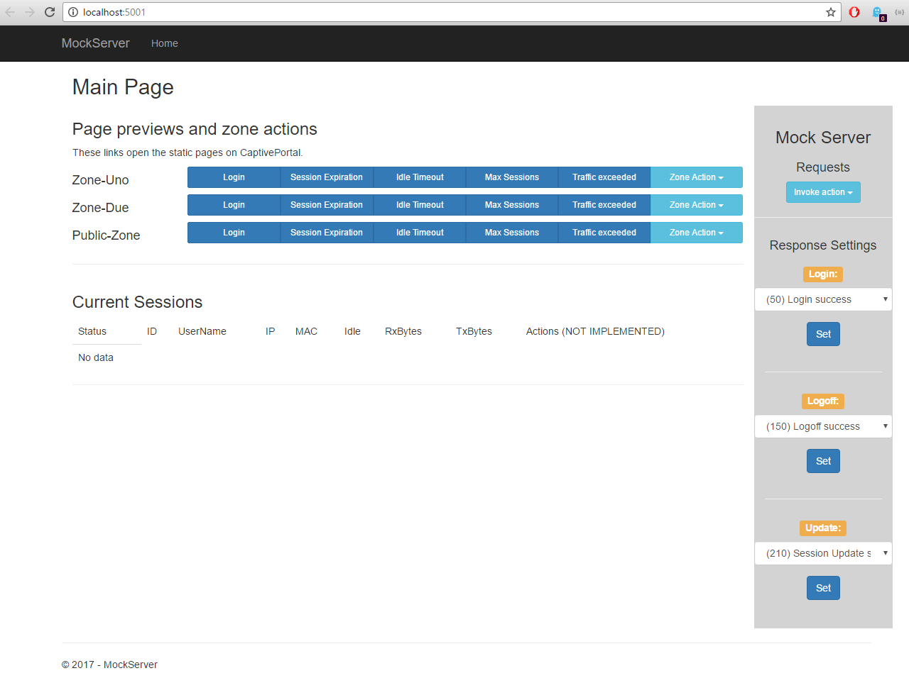

# MockServer - mocking a SonicWALL Guest Auth

This is the project for mocking a SonicWALL Guest Auth endpoints. It imitates a SonicWALL appliance for development of an external authentication server (captive portal).

[](https://ci.appveyor.com/project/kdaveid/captiveportal-mockserver)

### Platform

MockServer is built against ASP.NET Core 1.1.0 using the 1.0.0-preview2-003131 SDK. This is the only configuration we are going to support on the issue tracker.

Also we are staying on the project.json based tooling until Visual Studio 2017 has been released - IOW you need to use Visual Studio Update 3 with the preview ASP.NET Core tooling.

### How to build

- Install .NET Core 1.1
- Run build.ps1 from Powershell _or_
- Run build.sh on macOS / Linux

Then, goto [http://localhost:5001](http://localhost:5001)

### Using the mock server  

If you don't have a SonicWALL appliance handy you may use the mock server we provide. There is a minimal UI to control the behaviour of the server. 

It looks like this:




### How to contribute

See [contributing](./CONTRIBUTING.md)


## CaptivePortal Project

We're currently deciding about open source our CaptivePortal project. It is a ASP.NET Core 1.1 web application with a UI and manage website still being built.

Please make sure that you update `application.development.json` file within CaptivePortal web app accordingly: 
```
{
    "AppSettings" : {
        "SNWLBaseUrl" : "http://localhost:5001"
        ...
    }
}
...
```
_OR_ you can set the environment variable `ASPNETCORE_ENVIRONMENT` to `dev-mockserver`. Doing this, the Captive Portal web server will pick up the `appsettings.dev-mockserver.json` file.

