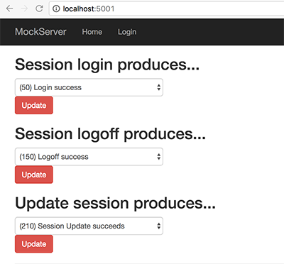

# Mock Server for CaptivePortal

This is the project for mocking a SonicWALL Guest Auth endpoints.

## Getting Started

Important note: Since we do not deliver a nuget package for core components (CaptivePortal.Models, CaptivePortal.Data and CaptivePortal.Infrastructure) the MockServer sources have to reside side-by-side to the CaptivePortal sources. 

```
ProjectsFolder
|-- CaptivePortal
|   |-- global.json
|
|-- CaptivePortal.MockServer
|   |-- global.json (-->pointing to ../CaptivePortal/src/...)
```

After cloning the repo you have to restore the nuget packages, bower packages and run bundle config for building ui components.

```
cd CaptivePortal.MockServer
dotnet restore
cd src/Dkbe.CaptivePortal.MockServer
bower install
dotnet bundle
dotnet run (<-- which invokes "dotnet bundle" as well)
```

Then, goto [http://localhost:5001](http://localhost:5001)

## Using the mock server
If you don't have a SonicWALL appliance handy you may use the mock server we provide. There is a minimal UI to control the behaviour of the server. 

It looks like this:




You need to restore its packages. Within root directory issue the following commands:
```
dotnet restore src/Dkbe.CaptivePortal.MockServer
dotnet run
```
The server will be available at port 5001. Please make sure that you update `application.development.json` file within CaptivePortal web app accordingly: 
```
{
    "AppSettings" : {
        "SNWLBaseUrl" : "http://localhost:5001"
        ...
    }
}
...
```
_OR_ you can set the environment variable `ASPNETCORE_ENVIRONMENT` to `dev-mockserver`. Doing this, the Captive Portal web server will pick up the `appsettings.dev-mockserver.json` file.

